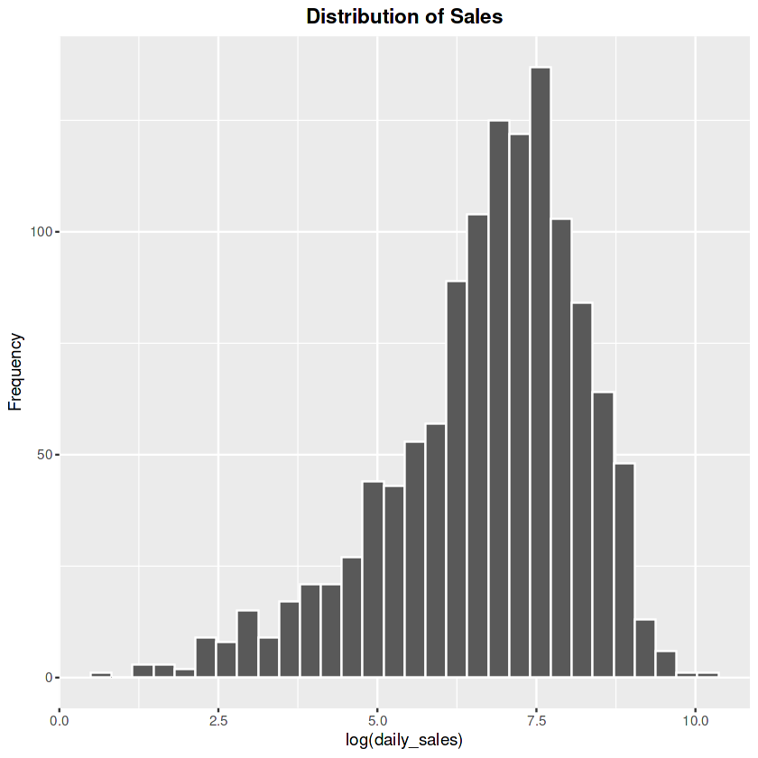
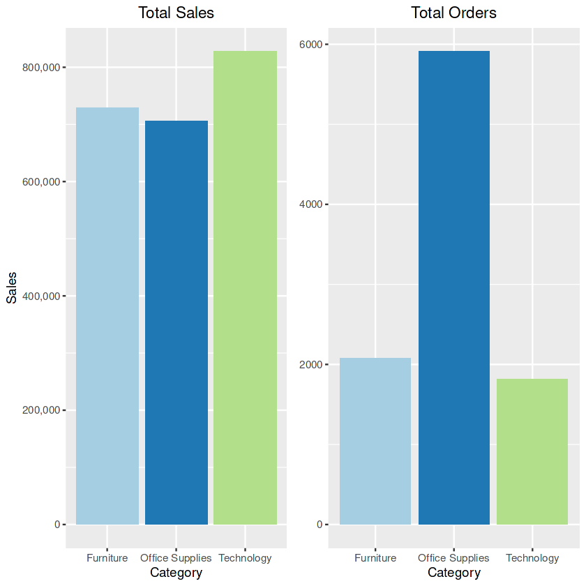
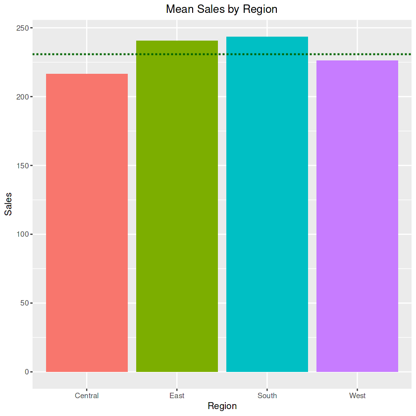
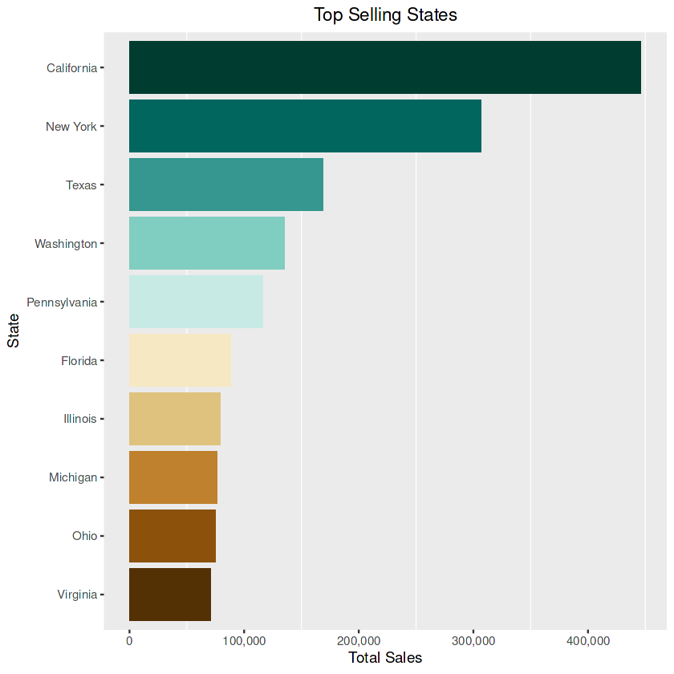
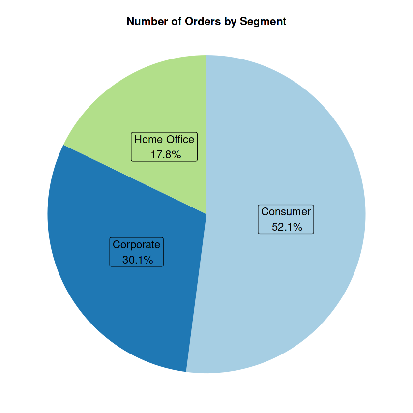
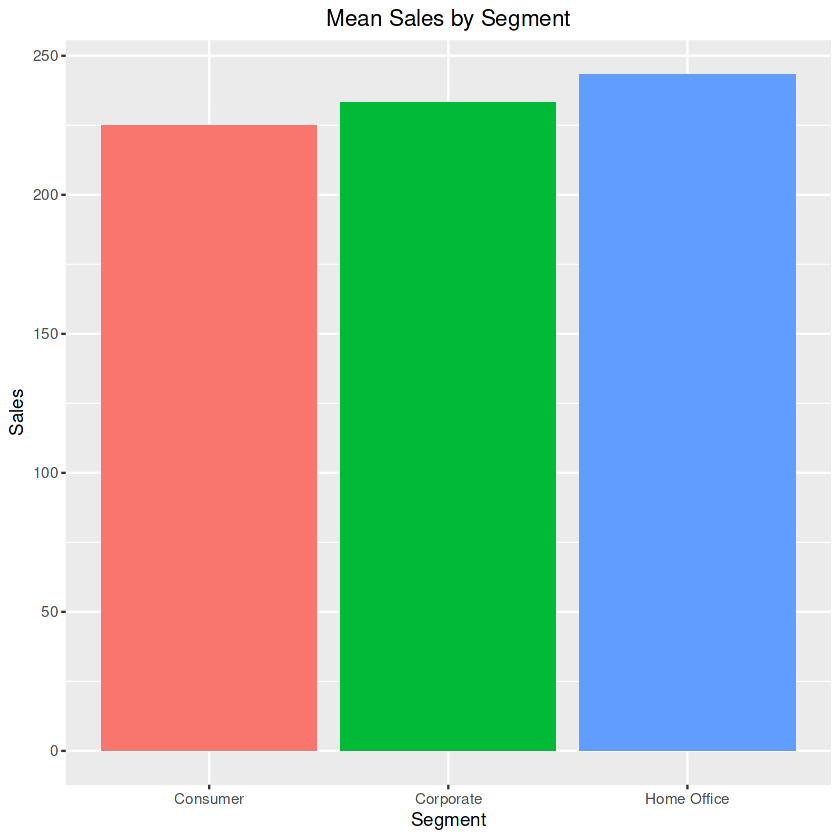
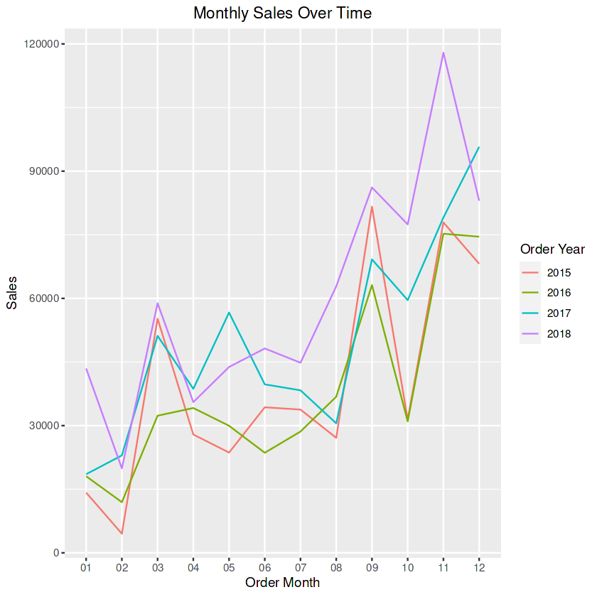

# 🛍️ Superstore Sales Analysis

This project analyzes sales performance and customer behavior using a dataset from a fictional superstore. The analysis was conducted in R and presented in a Jupyter Notebook format. It includes data cleaning, exploratory data analysis, and visualization.

---

## 📊 Project Goals

- Understand sales patterns across regions, categories, and customer segments
- Identify key drivers of profitability and loss
- Visualize trends and performance using `ggplot2`

---

## 📁 Dataset

- **Source:** [Superstore Sales Data by Bhanupratap Biswas](https://www.kaggle.com/datasets/bhanupratapbiswas/superstore-sales)
- **License:** ODC Public Domain
- **File Used:** `superstore_final_dataset.csv`

> *Note: Please ensure you comply with the licensing if sharing the dataset.*

---

## 📸 Visuals (Coming Soon)

### 1. Distribution of Daily Sales

### 2. Total Sales vs. Total Orders by Category

### 3. Regional & State-Level Insights
**Mean Sales by Region:**  

**Top 10 States by Total Sales:**  

### 4. Segment Analysis
**Order Volume by Segment (Pie Chart):**  

**Average Sale Value by Segment:**  

### 5. Monthly Sales Trends Over Time

---

## 📈 Key Insights

- 📈 **Strong Year-over-Year Growth:** Despite a dip in 2016, sales grew at an average rate of 25.47% annually since 2017, with 2018 marking a historic high.
- 🖥️ **Technology Leads in Revenue:** Technology is the top-performing category by total sales, while Office Supplies has the highest order volume.
- 🌎 **Regional Trends Vary:**  
  - Southern region has the highest *average* sales per order.  
  - Eastern region shows steady growth (18.1% annually).  
  - Central region is volatile, with losses in 2016 and 2018.  
  - California and New York are standout states for sales performance.
- 👥 **Consumers Drive Volume:** Over 50% of sales come from the Consumer segment, making them the primary target audience—though they have the lowest average order size.
- 🕒 **Seasonal Peaks:**  
  - March, September, and November consistently see sales spikes.  
  - Category-specific seasonality observed:  
    - **Technology** peaks in March and November  
    - **Furniture** in September and December  
- 🪑 **Category Momentum:**  
  - Furniture shows consistent 10.9% annual growth.  
  - Office Supplies surged post-2017.  
  - Technology expected to keep rising as digital adoption increases.
- 🧾 **Customer Behavior Insights:**  
  - Top customers are mostly in the Consumer segment (~70%).  
  - Home Office has the highest average sale but low frequency.  
  - Corporate peaks in November; consider loyalty incentives.
- 🚚 **Shipping Behavior:** Standard Class is used most frequently, even by top customers—indicating faster shipping options may not be worth the operational complexity.

---

## 📊 Tableau Dashboard

Explore the interactive version of this analysis on Tableau Public:

🔗 [Superstore Sales Monitor Dashboard](https://public.tableau.com/app/profile/dalya.s/viz/SuperstoreSalesMonitor/Dashboard1)

---

## 🔧 Tools Used

- **R** (Tidyverse, ggplot2)
- **Jupyter Notebook (IRKernel)**
- **Tableau**
- **Kaggle Notebook environment (originally)**

---

## 🚀 How to Run

1. Open the `.ipynb` file in Jupyter with R kernel enabled
2. Ensure the dataset CSV is placed in the working directory
3. Run all cells to reproduce the analysis

---

## 📌 Author

Dalya Sohl — [GitHub](https://github.com/dalyasohl)  
This project is part of my personal data portfolio. Feedback and suggestions welcome!

